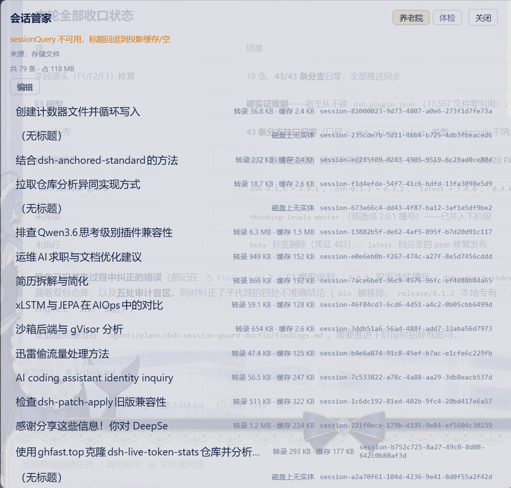

# dsh-session-steward (Session Steward)

- [中文 README](./README.md)
- [English README](./README.en.md)
- [日本語 README](./README.ja.md)
- [한국어 README](./README.ko.md)
- [Français README](./README.fr.md)
- [Deutsch README](./README.de.md)
- [Italiano README](./README.it.md)
- [Русский README](./README.ru.md)
- [Español README](./README.es.md)

Plugin web DSH per **file di cronologia delle sessioni + controlli di salute delle sessioni**.

> **Questa versione (0.5.0) adotta la linea DSH 0.2.0 come linea principale** (peer/engines = `>=0.2.0-rc.1 <0.2.1-0`, dist-tag npm `dsh-0.2.0`, ramo `compat/0.2.0`).
> La linea DSH 0.1.7 resta servita da 0.4.8 (dist-tag `dsh-0.1.7`, ramo `compat/0.1.7`) e non evolve più insieme alla presente linea.
> Le superfici dell'host consumate da questo plugin (formato sessione V4 e le liste di produttori first-party di `dsh-session-format-v3-to-v4`, le esportazioni di decodifica di `dsh-session`, il contratto della directory di archivio `session.jsonl.zstd`/`session.v3.jsonl.zstd` in doppio esemplare + `storages/session_projcache` + le due liste di id di `workspace.json`) sono state verificate punto per punto come **immutate in 0.2.0-rc.1, zero modifiche al codice**; questa versione è un adattamento di soli metadati (passaggio di generazione di peer/engines, devDependencies fissate esattamente su `0.2.0-rc.1`, disciplina di rilascio aggiornata con la versione).

- **Casa di riposo (file di cronologia)**: sfogliare l'insieme ufficiale degli archivi, con due operazioni **indipendenti** —
  **rimuovere lo stato di archiviazione** (modifica solo l'array, reversibile) ed **eliminare (purge) i file d'archivio** (cancella davvero le entità su disco, irreversibile).

> **Le due operazioni non sono intercambiabili e non possono essere fuse**:
>
> | | Rimuovere lo stato di archiviazione | Eliminare i file d'archivio (purge) |
> |---|---|---|
> | Rotta | `session-history-prune` | `session-history-purge` |
> | Cosa viene modificato | solo `global.archivedSessionIds` | cancella le entità su disco + modifica l'array degli archivi + modifica la tabella dei membri degli spazi di lavoro |
> | Destinazione della sessione | torna nello spazio di lavoro originale della barra laterale | scompare dal mondo |
> | Reversibile | ✅ | ❌ |
>
> **La purge comporta necessariamente la rimozione dello stato di archiviazione** — altrimenti resterebbero id zombie «invisibili nella barra laterale che, appena si rimuove loro l'archiviazione, diventano una sessione vuota».
> La dimensione è mostrata **per riga** (riscontrato in pratica: una singola voce può andare da 0 a 23 MB), il pulsante mostra il subtotale della selezione.
>
> **Due vincoli rigorosi** (da rispettare, altrimenti l'operazione è vana):
> 1. **Elenco e scrittura hanno la stessa fonte** — entrambe fanno riferimento al file di archiviazione `~/.dsh/storages/workspace.json`. Il `workspaceRegistry` in memoria dell'host è un'istantanea presa all'avvio: scrivere sul file non lo aggiorna; serve solo come superficie diagnostica per «già tolto dal file, ancora attivo in questo processo» (`pendingRestart`).
> 2. **Riavviare DSH subito dopo l'operazione** — il livello di archiviazione riscrive tutto e dà priorità alla memoria: prima che l'host termini, **qualsiasi** modifica ad archivi o spazi di lavoro riscrive integralmente il vecchio stato, azzerando l'operazione appena compiuta.
- **Check-up (controllo di salute / medico delle sessioni)**: check-up a quattro gate → prescrizione (elenco di comandi) → dimissione (intervento reversibile + confronto prima/dopo).

> Confine di denominazione: **questo pacchetto non offre ricerca né indicizzazione**. Ricerca/indicizzazione autonoma appartengono a un altro territorio (`dsh-search-index`); nessuna delle due parti usa i termini di sottodominio dell'altra e nessuna interpreta i campi dell'altra.

## Anteprima dell'interfaccia

Una voce **«Session Steward»** compare in fondo alla barra laterale, accanto a Ricerca e Impostazioni:


**Casa di riposo (file di cronologia)** — panoramica dell'insieme ufficiale degli archivi; ogni riga mostra la propria dimensione e lo stato dell'entità su disco; seleziona le righe per rimuovere l'archiviazione o eliminare (purge):



**Check-up** — il punto d'ingresso del check-up a quattro gate, che si conclude con una prescrizione reversibile:


## Installazione

```bash
dsh plugin --profile web add dsh-session-steward
# oppure una directory di sviluppo locale
dsh plugin --profile web add "link:E:/test/rewrite-agently/mine-dsh-plugins/dsh-session-steward"
```

Dopo l'installazione **è necessario riavviare il processo host** (ricaricare la pagina non basta).

## Contratto delle rotte

Prefisso `/session-steward/api`, nomi dei metodi sempre `session-*` (**mai** mescolarli con gli `index-*` dell'indice di ricerca);
un metodo non riconosciuto restituisce un errore esplicito, mai un silenzio.

| Metodo | Sottodominio | Funzione |
|---|---|---|
| `session-history-list` | history | elencare l'insieme degli archivi (file di archiviazione prioritario; con fonte, degrado, dimensione per riga e annotazione `pendingRestart`) |
| `session-history-prune` | history | **rimuovere lo stato di archiviazione**: togliere id dall'array degli archivi in blocco (backup automatico, richiesto riavvio) |
| `session-history-purge` | history | **eliminare i file d'archivio**: cancellare davvero la directory delle trascrizioni + la cache di proiezione + le due liste di id (**irreversibile**) |
| `session-health-status` | health | stato degli interruttori e tabella dei metodi (per il polling del pannello) |
| `session-health-scan` | health | check-up in blocco (per impostazione predefinita restituisce solo le sessioni non ok) |
| `session-health-session` | health | rapporto a quattro gate di una singola sessione + prescrizione |
| `session-health-repair` | health | intervento reversibile (messa in quarantena del record della cache di proiezione) + prima/dopo |

Namespace delle impostazioni: `session-steward`; id della voce della barra laterale: `dsh-session-steward`.

## I due interruttori (feature gate)

| Interruttore | Campo | Effetto alla disattivazione |
|---|---|---|
| File di cronologia delle sessioni | `historyFiles` (predefinito true) | `session-history-*` non viene registrato, la scheda «Casa di riposo» non viene resa |
| Controllo di salute | `healthCheck` (predefinito true) | `session-health-*` non viene registrato, la scheda «Check-up» non viene resa |

Una volta disattivato, il metodo corrispondente restituisce `{ ok: false, error: '子域已关闭（…=false）：<method> 未注册' }` — **nessun guscio vuoto**.

## Il check-up a quattro gate

| gate | Criterio | level |
|---|---|---|
| `log-integrity` | scansione multi-frame zstd → dispiegamento della provenance → disimpacchettamento delle righe impacchettate; seq continui, nessun frame finale strappato | `fail` in caso di problemi di lettura; `warn` se solo frame finale strappato |
| `projection-cache` | ritardo del `minSeq` di `~/.dsh/storages/session_projcache/sessions/<id>.json` rispetto all'ultimo seq del log + campi non saldati (openStep / activeStep.active / pendingTurnStart / turnBoundary=start) | `fail` se ritardo e non saldato; `warn` se uno solo dei due |
| `lossless-json` | giudizio riga per riga sul JSON senza perdite tramite il `sessionProjections.checkpoint(session)` a caldo (undefined / numeri non finiti / -0 / buchi sparsi / prototipo non ordinario / funzioni·Symbol·BigInt / cicli) | `fail` in caso di riscontro, con chiave di proiezione → pacchetto attribuito |
| `cold-read` | motivo dell'ultimo `turn/end`, esistenza di un open step non chiuso, eventuale output dell'assistant dopo l'ultimo messaggio user | `fail` se open step; `warn` se interrupted/assenza di turn/end |

**La prescrizione** propone solo tre cose reversibili: ① mettere in quarantena il record danneggiato della cache di proiezione (prima il backup) ② se restano step non saldati, ricordare di attendere la saldazione da parte dell'host ③ produrre un elenco di comandi eseguibili.
**Vietato**: riscrivere i log di sessione, modificare i dati storici, scartare silenziosamente campi.

## L'unico contratto con `dsh-search-index`

Formato del file d'archivio (`global.archivedSessionIds` di `~/.dsh/storages/workspace.json`):
**questo plugin scrive, l'indice di ricerca fa solo lettura**. Descrizione del formato in
`dsh-docs-deliverables/dsh-归档文件格式契约-20260914.md`.

## Sviluppo

```bash
pnpm install
pnpm typecheck     # tsc -b --pretty false
pnpm test          # vitest run
pnpm build         # tsc -b && tsdown → lib/index.js + lib/client.js
```

## Licenza

MIT
