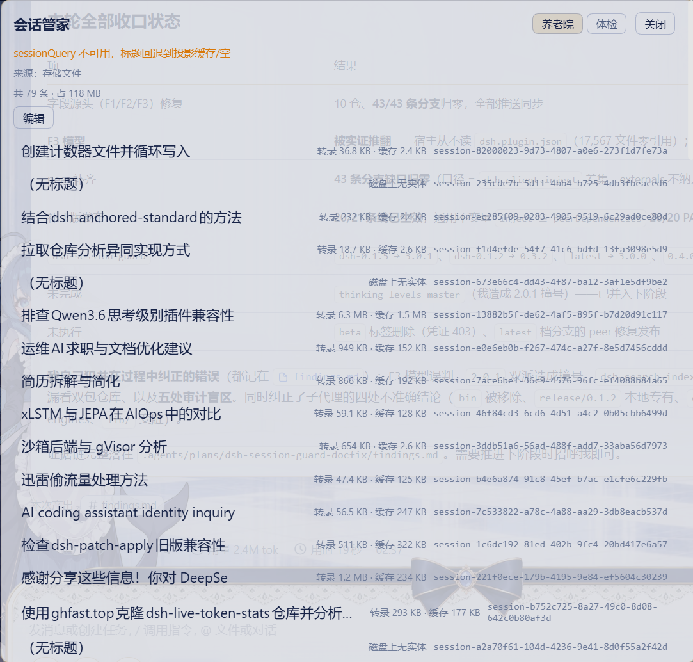
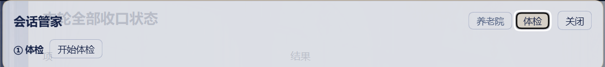

# dsh-session-steward（セッション・スチュワード）

**セッション履歴ファイル**と**セッション健康チェック**のための DSH Web プラグインです。セッションデータそのものには一切触れません。

- **カルテ室（履歴ファイル）** — 公式アーカイブ集合を閲覧し、ID を一括整理します
  （バックアップ + アトミック置換。ホストに再読み込みさせるには DSH の再起動が必要です）。
- **健診（健康チェック）** — 四つのゲート → 処方（コマンド一覧）→ 退院（before/after 比較を伴う
  可逆的な修復）。

> 命名の境界：**本パッケージは検索・インデックス機能を一切提供しません**。検索／インデックスは
> `dsh-search-index` に属し、双方が相手のフィールドに言及したり再解釈したりすることはありません。

## スクリーンショット

サイドバー下部に **「会话管家」**（セッション・スチュワード）のエントリが追加され、検索・設定と並びます：


**カルテ室（履歴ファイル）** — 公式アーカイブ集合の一覧。各行にサイズとディスク上の実体の有無を表示し、選択してアーカイブ解除または整理ができます：



**健診** — 四つのゲートによる健診の入口。スキャン後に可逆的な処方を提示します：



## インストール

```bash
dsh plugin --profile web add dsh-session-steward
```

その後、ホストプロセスを再起動してください（ページの再読み込みでは不十分です）。

## ルート

プレフィックスは `/session-steward/api`。メソッド名はすべて `session-*`（`index-*` は使いません）で、
未知のメソッドは黙って失敗せず明示的なエラーを返します。

| メソッド | ドメイン | 用途 |
|---|---|---|
| `session-history-list` | history | 公式アーカイブ集合を一覧表示（取得元と縮退の注記付き） |
| `session-history-prune` | history | アーカイブ配列から ID を一括削除（自動バックアップ、再起動が必要） |
| `session-health-status` | health | スイッチの状態とメソッド一覧（パネルのポーリング用） |
| `session-health-scan` | health | 一括健診（既定では非 ok のセッションのみ） |
| `session-health-session` | health | 1 セッションの四ゲートレポートと処方 |
| `session-health-repair` | health | 可逆的な修復（プロジェクションキャッシュのレコードを隔離）と before/after 対照 |

設定名前空間は `session-steward`、サイドバーエントリ ID は `dsh-session-steward`。

## スイッチ（フィーチャーゲート）

| スイッチ | フィールド | オフのとき |
|---|---|---|
| セッション履歴ファイル | `historyFiles`（既定 true） | `session-history-*` は登録されず、カルテ室タブも描画されない |
| 健康チェック | `healthCheck`（既定 true） | `session-health-*` は登録されず、健診タブも描画されない |

閉じられたドメインは `{ ok: false, error: '子域已关闭（…=false）：<method> 未注册' }` を返します — 空の殻は残しません。

## `dsh-search-index` との契約

アーカイブファイル形式（`~/.dsh/storages/workspace.json` の `global.archivedSessionIds`）は、
**本プラグインが書き込み、検索インデックスプラグインは読み取りのみ**です。詳細は
`dsh-docs-deliverables/dsh-归档文件格式契约-20260914.md` を参照してください。

## 開発

```bash
pnpm install
pnpm typecheck
pnpm test
pnpm build
```

## ライセンス

MIT
